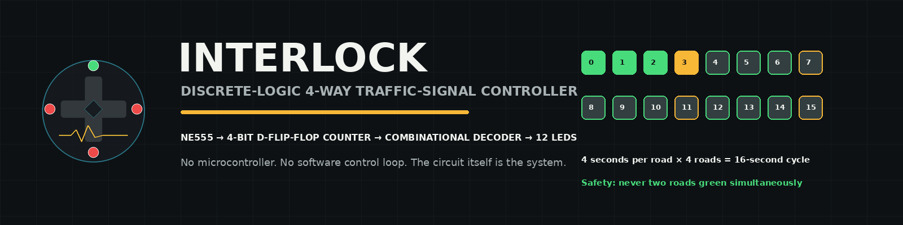
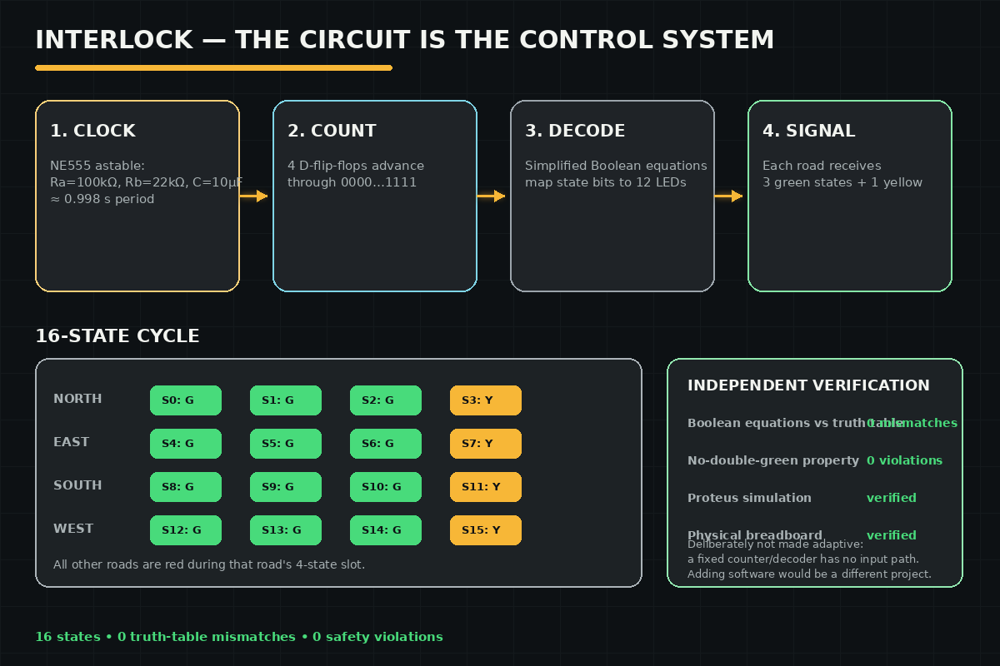

# Interlock — 4-Way Traffic Signal Controller




## Course Information

| Field | Details |
|---|---|
| Course | Digital Logic Design |
| Semester | Semester 2 — Spring 2024 |
| University | Air University, Islamabad |
| Student | Hussain Ali (232095) |

## Overview

A 4-way traffic signal controller built from discrete digital logic — an
NE555 astable timer, a 4-bit D-flip-flop counter, and combinational
decoding logic — verified in both Proteus simulation and a physical
breadboard prototype.

## Problem Statement

Design a working traffic-light sequencer using only discrete timer and
flip-flop ICs (no microcontroller), producing a correct, repeatable
red/yellow/green cycle across four roads.

## Objectives

- Generate a stable ~1Hz clock with an NE555 astable timer.
- Use a 4-bit D-flip-flop counter to cycle through 16 states.
- Decode counter states into correct LED outputs for all 4 roads.

## Tools and Technologies

- Proteus 8 (simulation)
- NE555 timer IC (Ra=100kΩ, Rb=22kΩ, C=10µF)
- D flip-flops and discrete logic gates
- Breadboard, LEDs, resistors (physical prototype)

## Features

- Full 16-second cycle (4 seconds per road: 3s green + 1s yellow).
- 16-state counter mapped to 12 LED outputs (4 roads × red/yellow/green).
- Verified in both simulation and physical hardware.

## Methodology

1. Calculate NE555 timing component values for a ~1Hz clock.
2. Design the D-flip-flop counter and state-to-output decoding logic.
3. Build and verify the circuit in Proteus.
4. Rebuild on a physical breadboard and confirm matching behavior.

## How It Works



## Repository Structure

```text
4-way-traffic-signal-controller/
  README.md
  PROJECT_NOTES.md
  REPORT.md
  DEMO.md          a timed live-demo script (what to show, in what order)
  CHANGELOG.md
  design/4way-signal-truth-table.xlsx
  proteus/
    FourWayTrafficSignal_Recreated.pdsprj
    Proteus-Reconstruction-Guide.md
  media/            (photos + video of the physical prototype)
  screenshots/
  project.yaml
```

## Setup Instructions

Open `proteus/FourWayTrafficSignal_Recreated.pdsprj` in Proteus 8, or
follow `proteus/Proteus-Reconstruction-Guide.md` to rebuild the circuit
from scratch (including physical hardware).

## Usage

Run the Proteus simulation to observe the LED sequence, or use the
reconstruction guide to build and observe the physical breadboard version.

## How to Review

1. Start with this README and `REPORT.md`.
2. Review `design/4way-signal-truth-table.xlsx` — the full state table (all 16 states → road outputs), including the derived Boolean equations for each output.
3. Open the Proteus project or follow the reconstruction guide.
4. Check `screenshots/` and `media/` for simulation and hardware evidence.
5. See `DEMO.md` for a ready-to-run live demo script — useful for
   presenting this project directly rather than just reading about it.

## Screenshots

See `screenshots/` (8 images: Proteus modules, running states, hardware) and `media/` (photos + a video of the physical prototype).

## Results

A full state table (states 0–15 mapped to road states) and a verification
checklist were completed with every item passing: correct ~1s timer period
(calculated ≈0.998s), correct road sequencing, and confirmed matching
behavior on physical hardware. The design was additionally verified
analytically: every simplified Boolean equation in the truth-table
spreadsheet was checked programmatically against its own recorded output
across all 16 states (0 mismatches), and the full state table was checked
for the one safety property that matters even in an educational design —
no state ever shows more than one road green at the same time (also
confirmed, 0 violations). See `REPORT.md` §11 for the full breakdown.

## Limitations

- No pedestrian-crossing signal or emergency-vehicle override.
- Fixed timing — no adaptive/traffic-responsive logic.

## Future Enhancements

- Add a pedestrian-crossing phase.
- Add a microcontroller-based variant for comparison with the discrete-logic version.
- Adaptive/traffic-responsive timing was considered as an enhancement
  direction and deliberately deferred: a discrete counter-and-decoder
  circuit has no way to accept outside input, so real adaptivity would
  require a fundamentally different architecture (a microcontroller or
  FPGA reading vehicle sensors), not a modification of this circuit.
  Bolting a software adaptive-timing layer onto this project wouldn't
  demonstrate more digital-logic/hardware skill — it would just be an
  unrelated software project stapled to this one. See `DEMO.md` for how
  this is explained live.

## Safety and Privacy

No secrets, credentials, or private data are involved — this is a pure
digital-logic hardware exercise.

## Ethical Notice

Academic coursework exercise; no ethical concerns apply.
