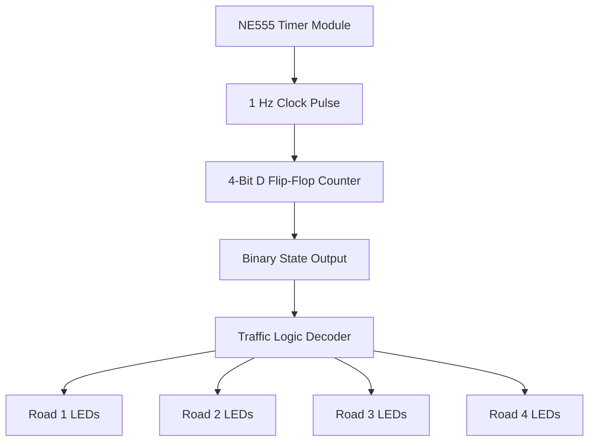
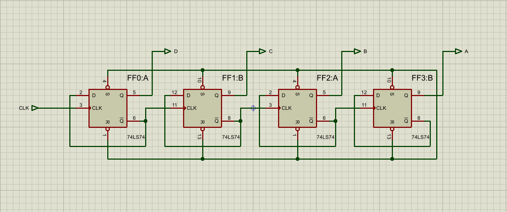
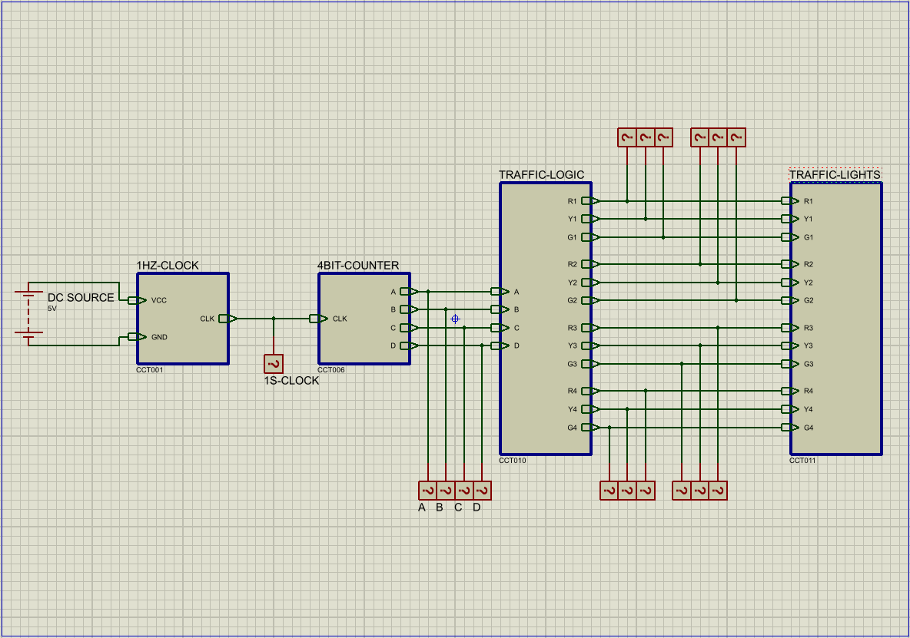
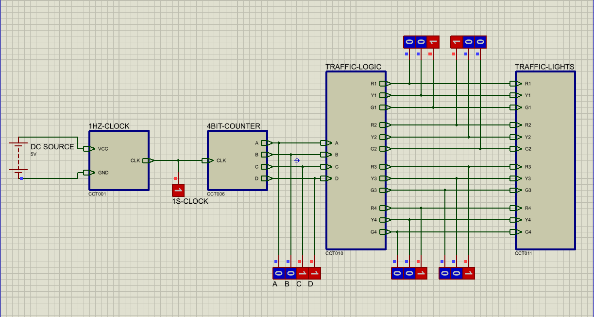
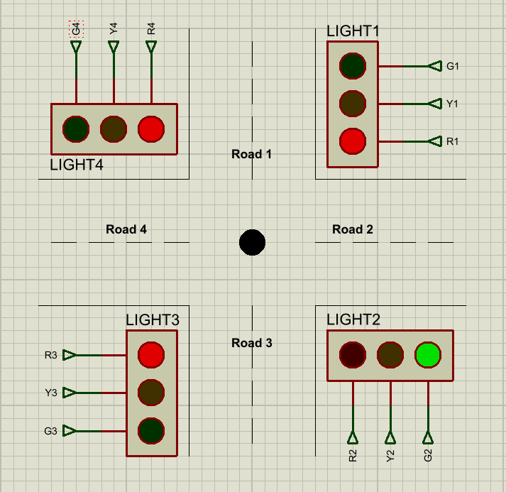
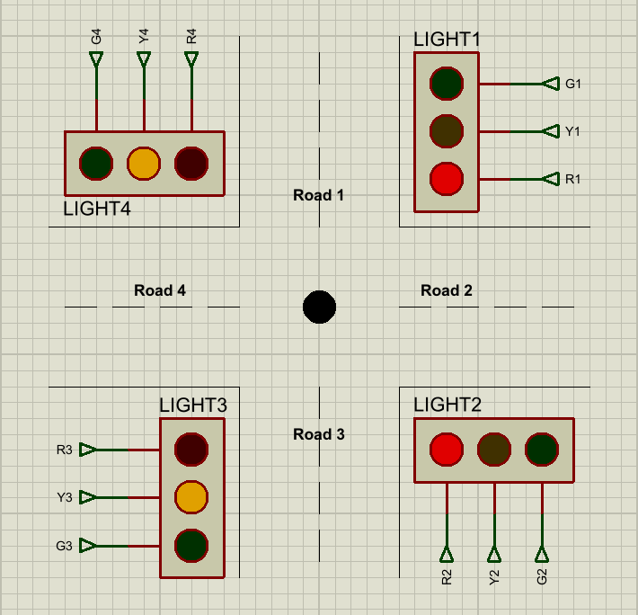
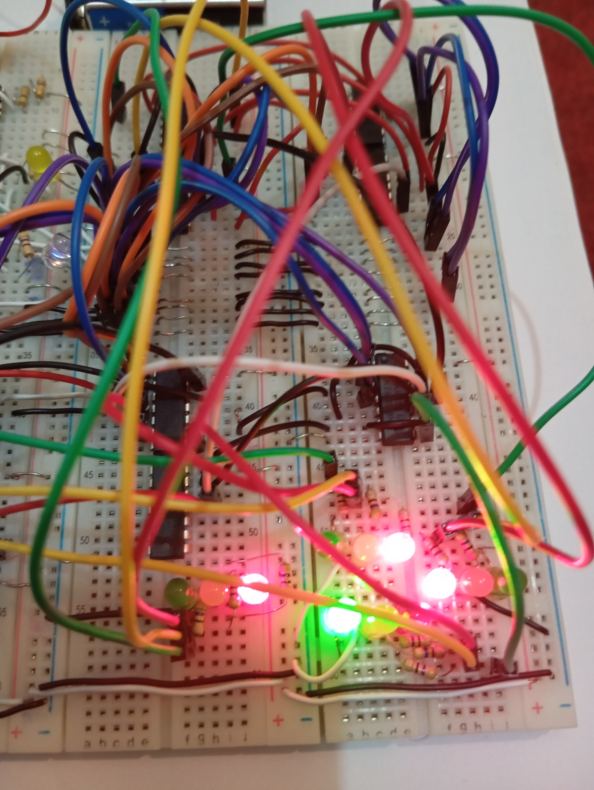

# 4-Way Traffic Signal Controller — Technical Report


## Abstract

This report presents the design and implementation of a **4-way traffic signal controller** developed as a Digital Logic Design project. The system controls four traffic directions using a sequential timing pattern, where each road receives a green signal for a fixed interval followed by a yellow transition state. The controller was implemented using digital logic concepts including an **NE555 timer**, a **4-bit D flip-flop counter**, Boolean output logic, LEDs, and Proteus circuit simulation.

The project was designed to demonstrate how a real-world control problem can be modeled using sequential and combinational logic without relying on a microcontroller. A Proteus simulation was created to verify the circuit behavior, and a hardware prototype was built using LEDs, resistors, breadboard wiring, and digital logic components.

---

## Table of Contents

- [1. Introduction](#1-introduction)
- [2. Problem Statement](#2-problem-statement)
- [3. Project Objectives](#3-project-objectives)
- [4. Design Requirements](#4-design-requirements)
- [5. System Architecture](#5-system-architecture)
- [6. Timing Design](#6-timing-design)
- [7. State Sequence](#7-state-sequence)
- [8. Module-Level Design](#8-module-level-design)
- [9. Proteus Simulation](#9-proteus-simulation)
- [10. Hardware Implementation](#10-hardware-implementation)
- [11. Verification and Results](#11-verification-and-results)
- [12. Limitations](#12-limitations)
- [13. Future Improvements](#13-future-improvements)
- [14. Learning Outcomes](#14-learning-outcomes)
- [15. Conclusion](#15-conclusion)

---

## 1. Introduction

Traffic signal systems are a practical example of sequential control logic. At a road intersection, the controller must ensure that only the correct direction receives permission to move while other directions remain stopped. This makes traffic signal control a useful academic problem for understanding digital logic design.

In this project, a 4-way traffic signal controller was designed using basic digital logic components. The system follows a repeated timing cycle and controls red, yellow, and green LEDs for four roads. The controller was first modeled and tested in Proteus, then demonstrated using hardware implementation evidence.

The main purpose of this project was not only to make traffic LEDs blink, but to understand how timing, state sequencing, and logic decoding work together inside a digital control system.

---

## 2. Problem Statement

The task was to design a traffic signal controller for a 4-way intersection using digital logic components. The system needed to manage signal timing automatically, provide safe transitions between roads, and repeat the traffic cycle continuously.

The design had to satisfy the following core behavior:

- Only one main road direction should receive a green signal at a time.
- Yellow transitions should appear between green states.
- Non-active roads should remain red.
- The signal cycle should repeat automatically.
- The system should be implemented using digital logic concepts rather than software-based control.

---

## 3. Project Objectives

The objectives of the project were to:

- Design a 4-way traffic signal controller using sequential logic.
- Generate a regular timing pulse using an NE555 timer circuit.
- Use a counter to generate state transitions.
- Decode counter states into traffic signal outputs.
- Simulate the circuit in Proteus.
- Build and test a physical hardware prototype.
- Document the design using screenshots, truth table, report, and demo media.
- Strengthen understanding of digital logic components and state-based control systems.

---

## 4. Design Requirements

The project followed the academic requirement of using base digital logic components instead of a microcontroller or ready-made traffic controller IC.

### Functional Requirements

| Requirement | Description |
|---|---|
| Four-road control | The system must control four different road directions |
| Green interval | Each road should receive a green signal for approximately 3 seconds |
| Yellow transition | Each road should include an approximately 1-second yellow transition |
| Red safety state | Roads not currently active should remain red |
| Repeating cycle | The signal pattern should repeat continuously |
| Visual output | LEDs should represent red, yellow, and green signals |

### Design Constraints

| Constraint | Description |
|---|---|
| No microcontroller | The system should be built from digital logic components |
| Timer-based sequencing | Clock pulses should be generated using an NE555 timer |
| Counter-based control | Signal states should be driven using a binary counter |
| Simulation required | The circuit should be verified in Proteus |
| Hardware evidence required | Physical LED output should demonstrate working behavior |

---

## 5. System Architecture

The system is divided into four main modules:

```text
NE555 Timer
     ↓
4-Bit D Flip-Flop Counter
     ↓
Traffic Logic Circuit
     ↓
Traffic Light LED Outputs
```

### Architecture Overview



### Module Summary

| Module | Function |
|---|---|
| Timer Module | Generates periodic clock pulses |
| Counter Module | Produces sequential binary states |
| Traffic Logic Module | Converts counter states into LED control signals |
| Traffic Lights Module | Displays the final red/yellow/green outputs |

This modular design made the circuit easier to simulate, troubleshoot, explain, and implement physically.

---

## 6. Timing Design

The traffic controller uses an approximate **1 Hz clock**, meaning the counter advances by one state every second.

The timing pattern is:

| Signal Phase | Duration |
|---|---:|
| Green signal | 3 seconds |
| Yellow transition | 1 second |
| Full cycle | 16 seconds |

Since there are four roads, each road receives a 4-second slot:

```text
3 seconds green + 1 second yellow = 4 seconds per road
4 roads × 4 seconds = 16 seconds per full cycle
```

### NE555 Timer Calculation

The NE555 timer was used in astable mode.

For an astable NE555 timer, the approximate period is:

```text
T ≈ 0.693 × (Ra + 2Rb) × C
```

The selected values were:

```text
Ra = 100kΩ
Rb = 22kΩ
C  = 10µF
```

Substitution:

```text
T ≈ 0.693 × (100kΩ + 2×22kΩ) × 10µF
T ≈ 0.693 × 144kΩ × 10µF
T ≈ 0.998 seconds
```

So the timer output is approximately:

```text
T ≈ 1 second
```

This clock pulse drives the counter and advances the signal state sequence.

---

## 7. State Sequence

The project uses a 4-bit counter, which can represent 16 binary states from `0000` to `1111`.

Each state corresponds to a traffic signal output pattern.

| State | Binary | Road 1 | Road 2 | Road 3 | Road 4 | Description |
|---:|:---:|---|---|---|---|---|
| 0 | 0000 | Yellow | Red | Red | Yellow | Wrap-around transition state |
| 1 | 0001 | Green | Red | Red | Red | Road 1 green phase |
| 2 | 0010 | Green | Red | Red | Red | Road 1 green phase |
| 3 | 0011 | Green | Red | Red | Red | Road 1 green phase |
| 4 | 0100 | Yellow | Yellow | Red | Red | Road 1 to Road 2 transition |
| 5 | 0101 | Red | Green | Red | Red | Road 2 green phase |
| 6 | 0110 | Red | Green | Red | Red | Road 2 green phase |
| 7 | 0111 | Red | Green | Red | Red | Road 2 green phase |
| 8 | 1000 | Red | Yellow | Yellow | Red | Road 2 to Road 3 transition |
| 9 | 1001 | Red | Red | Green | Red | Road 3 green phase |
| 10 | 1010 | Red | Red | Green | Red | Road 3 green phase |
| 11 | 1011 | Red | Red | Green | Red | Road 3 green phase |
| 12 | 1100 | Red | Red | Yellow | Yellow | Road 3 to Road 4 transition |
| 13 | 1101 | Red | Red | Red | Green | Road 4 green phase |
| 14 | 1110 | Red | Red | Red | Green | Road 4 green phase |
| 15 | 1111 | Red | Red | Red | Green | Road 4 green phase |

### Note on State 0

State `0000` appears as a wrap-around transition state between the end of Road 4's green phase and the start of Road 1's green phase. This makes the cycle continuous and provides a visible transition before the next full green sequence begins.

---

## 8. Module-Level Design

### 8.1 Timer Module

The timer module generates the base clock signal. The NE555 timer was selected because it is commonly used in digital electronics labs and can be configured easily in astable mode.

**Purpose:**

- Generate a periodic pulse
- Drive the state counter
- Control the timing of traffic signal changes

Screenshot reference:

```text
screenshots/proteus-ne555-timer-module.png
```


---

### 8.2 Counter Module

The counter module generates the sequence of binary states. In this project, a 4-bit counter was implemented using D flip-flops.

**Purpose:**

- Count from 0 to 15
- Represent each traffic phase as a binary state
- Provide inputs to the traffic logic decoder

Screenshot reference:

```text
screenshots/proteus-dff-counter-module.png
```



---

### 8.3 Traffic Logic Module

The traffic logic module converts the counter outputs into red, yellow, and green LED signals. This is the combinational logic part of the design.

**Purpose:**

- Decode counter states
- Activate the correct LED outputs
- Maintain the required traffic sequence
- Ensure non-active roads stay red

Screenshot reference:

```text
screenshots/proteus-traffic-logic-module.png
```


---

### 8.4 Traffic Lights Module

The traffic lights module shows the final output using LEDs.

**Purpose:**

- Display red, yellow, and green states
- Visually confirm circuit behavior
- Represent the real-world traffic light system

Screenshot reference:

```text
screenshots/proteus-traffic-lights-module.png
```


---

## 9. Proteus Simulation

The complete circuit was recreated and tested in Proteus. The simulation was divided into modules to make the design easier to understand and debug.

The Proteus project file is stored at:

```text
proteus/FourWayTrafficSignal_Recreated.pdsprj
```

A reconstruction guide is also included:

```text
proteus/Proteus-Reconstruction-Guide.md
```

### Main Circuit



### Running State Overview



### Example Running States





---

## 10. Hardware Implementation

After simulation, the project was also demonstrated using a physical hardware prototype. LEDs were used to represent the red, yellow, and green traffic lights. Breadboard wiring and supporting digital logic components were used to reproduce the circuit behavior.

Hardware evidence is included in:

```text
screenshots/hardware-running-state.jpg
media/led-output-state-green.jpg
media/led-output-state-red-yellow.jpg
media/traffic-signal-demo.mp4
```

### Hardware Running State



### Hardware Output Media

```text
media/led-output-state-green.jpg
media/led-output-state-red-yellow.jpg
media/traffic-signal-demo.mp4
```

The media files show physical LED output states and the working behavior of the prototype.

---

## 11. Verification and Results

The design was verified through both simulation and hardware evidence.

### Verification Checklist

| Test Area | Expected Result | Verified |
|---|---|:---:|
| Timer output | Approximately 1-second clock pulse | Yes |
| Counter behavior | Sequential state progression from 0 to 15 | Yes |
| Road 1 output | Green for 3 states, yellow transition afterward | Yes |
| Road 2 output | Green for 3 states, yellow transition afterward | Yes |
| Road 3 output | Green for 3 states, yellow transition afterward | Yes |
| Road 4 output | Green for 3 states, yellow transition afterward | Yes |
| Repeating cycle | Sequence restarts after full cycle | Yes |
| Proteus simulation | Circuit modules run correctly | Yes |
| Hardware evidence | LED outputs demonstrate working behavior | Yes |

### Result Summary

The Proteus simulation successfully demonstrated the planned state sequence. The timer generated clock pulses, the counter advanced through the binary states, and the traffic logic activated the appropriate LEDs.

The hardware evidence also confirmed that the design was practically implemented and that the LED outputs followed the intended signal pattern.

---

## 12. Limitations

This project is an educational prototype and has the following limitations:

- It is not suitable for real-world traffic deployment.
- Timing depends on practical component tolerances.
- The design does not include pedestrian crossing logic.
- The design does not include emergency vehicle override.
- The design does not include traffic density sensors.
- There is no fail-safe or fault detection mechanism.
- The hardware implementation is prototype-based and not safety certified.
- The Proteus file is a recreated simulation version for documentation and portfolio review.

---

## 13. Future Improvements

Possible improvements include:

- Add pedestrian crossing signals.
- Add emergency vehicle priority mode.
- Add traffic density sensors.
- Add adaptive timing logic.
- Add manual reset and override controls.
- Add seven-segment countdown displays.
- Add Karnaugh map simplification documentation.
- Add formal timing diagrams.
- Add PCB design for a cleaner hardware version.
- Add a microcontroller-based version for comparison.
- Add safety interlock logic to avoid conflicting green signals.
- Add automated screenshots or state logs for each counter state.

---

## 14. Learning Outcomes

This project strengthened understanding of:

- Sequential logic design
- Combinational logic design
- Clock generation using NE555 timer
- D flip-flop based counters
- Binary state sequencing
- Truth table design
- LED output mapping
- Proteus simulation
- Breadboard prototyping
- Debugging digital circuits
- Documenting hardware projects for GitHub

---

## 15. Conclusion

The 4-way traffic signal controller successfully demonstrates how a real-world control system can be modeled using Digital Logic Design concepts. By combining an NE555 timer, a 4-bit D flip-flop counter, traffic logic gates, and LED outputs, the project shows how sequential and combinational circuits can work together to control a repeated timing sequence.

The Proteus simulation verified the circuit behavior, while the hardware prototype provided practical evidence of the design. Although the project is not intended for real-world traffic deployment, it effectively demonstrates the academic concepts of timing, counting, decoding, and digital output control.

---

## Project Evidence

| Evidence Type | File/Folder |
|---|---|
| Truth Table | `design/4way-signal-truth-table.xlsx` |
| Proteus Project | `proteus/FourWayTrafficSignal_Recreated.pdsprj` |
| Reconstruction Guide | `proteus/Proteus-Reconstruction-Guide.md` |
| Screenshots | `screenshots/` |
| Hardware Photos | `media/` and `screenshots/hardware-running-state.jpg` |
| Demo Video | `media/traffic-signal-demo.mp4` |
